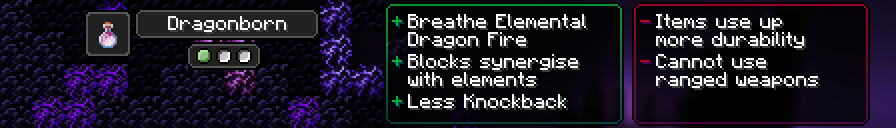

# Dragonborn

[Origin](../../origins.md).

These prestigious half-dragons take in the elements to enhance their indomitable power.

ID: `toomanyorigins:dragonborn`

## Powers

Name | ID | Description (In-Game) | Description (Detailed)
-----|----|-----------------------|------------------------
Draconic Breath | `toomanyorigins:draconic_breath` | You are able to breathe out a ball of elemental breath, the element of your breath can be changed by using specific items. | Your active power (default: G) allows you to breathe out a fireball that can be one of three different types that upon landing, will turn into an area of effect cloud that do different things. You are able to swap between these types by using an item in your main or offhand. Fire (swapped to by using anything inside the `toomanyorigins:fireball_activators` item tag) produces a purple cloud that will increase the damage received by 3 to any entity in the cloud besides yourself. Frost (swapped to by using anything inside the`toomanyorigins:frostball_activators` item tag) produces a blue cloud that will slow entities down each tick until they are at 20% of their original speed after 2 seconds inside the cloud. Thunder (swapped to by using anything inside the `toomanyorigins:thunderball_activators` item tag) produces a pink cloud that will deal 40% of the initial attack to any other entity in the cloud when you attack one of the entities in the cloud. This counts as magic damage and will bypass armor. This power has a cooldown of 2 seconds.
Block Synergistics | `toomanyorigins:block_synergistics` | Certain blocks may react in different ways when your elemental ball hits them. | This power does nothing but this description will explain the part of `draconic_breath `that it's referring to. Fire breath projectiles are able to light up furnaces and campfires inside the `toomanyorigins:lightable` block tag, Frost breath projectiles are able to freeze surfaces of water for a brief moment, and Thunder breath projectiles are able to activate lightning rods when it is not thundering, or summon lightning at lightning rods when it is thundering.
Weaponry Pride | `toomanyorigins:weaponry_pride` | Your prideful nature makes you unable to use any ranged weapons. | You are unable to use any items found within the `toomanyorigins:projectile_based` item tag.
Zenith Scales | `toomanyorigins:zenith_scales` | You take reduced knockback when damaged. | You get an additional 0.2 knockback resistance.
Rough Claws | `toomanyorigins:rough_claws` | Items may use up more durability than usual. | You have a 40% chance to use up extra durability on any of your items whenever you use up durability on your items.