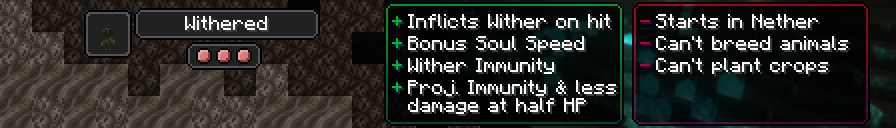

# Withered

[Origin](../../origins.md).

Originally human, their ancestors have paid the price for harnessing the chaotic power of the Wither.

ID: `toomanyorigins:withered`

## Powers

Name | ID | Description (In-Game) | Description (Detailed)
-----|----|-----------------------|------------------------
Wither Toxins | `toomanyorigins:wither_toxins` | Your melee attacks inflict the Wither effect for a short time. | Your melee attacks inflict a wither effect on non Undead entities for 5 seconds. This has a recharge time of 6 seconds.
Nether Inhabitant | `origins:nether_spawn` |  Your natural spawn will be in the Nether. | You will be teleported into the Nether when choosing this Origin. If you choose it by using an Orb of Origin, you will only respawn in the Nether if you die and do not have a valid spawn point in the overworld.
Black Thumb | `toomanyorigins:black_thumb` | You spread decay to any overworld crops you plant, making them unable to grow. | Any crop that originates from the overworld (for example: wheat, potatoes) that you plant are replaced with withered versions of them. These withered versions are unable to age/grow.
Weariness | `toomanyorigins:weariness` | As animals are weary around you, you are unable to breed animals. | You are unable to breed any animals and they will not follow you if you hold out their preferred food.
Spirit Strider | `toomanyorigins:scorched_structure` | You have one extra level of Soul Speed at all times. | One level of the soul speed enchantment is added to you at all times. Having boots without soul speed does not use up the durability of them.
Soul Shield | `toomanyorigins:soul_shield` | When you are at 50% of your maximum health or below, you create a soul projection around yourself, making yourself more resistant to damage and immune to projectiles. | When you are at 50% of your maximum health or less you gain the soul shield effect, making you take 20% less damage and immune to any damage source tagged as a projectile.
*hidden* | `toomanyorigins:soul_shield_overlay` | *none* | Creates an energy swirl overlay similar to that of the Wither entity's when you are at 50% of your maximum health or below.
Infused Veins | `toomanyorigins:wither_immunity` | You are immune to the Wither effect. | You are immune to wither effects.
*hidden* | `toomanyorigins:unholy` | *none* | You take `2.5 * level` extra damage from the Smite enchantment.