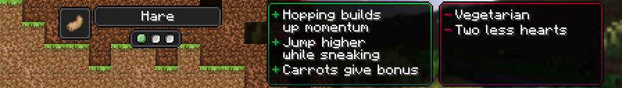

# Hare

!!! note

    The below details legacy content, accessed through a datapack in the world creation screen, or can be downloaded at [this GitHub Repository.](https://github.com/MerchantPug/legacy-toomanyorigins-datapack)

[Origin](../../origins.md).

A race of burrow dwelling rabbits that had attained a level of awareness akin to humans. They inherited their proficient mobility.

ID: `toomanyorigins:hare`

## Powers

Name | ID | Description (In-Game) | Description (Detailed)
-----|----|-----------------------|------------------------
Bunny Hop | `toomanyorigins:bunny_hop` | You build up momentum while in the air which is added to your movement speed. You keep built up momentum momentarily while on the ground. You may also gain momentum with your active ability. | You gain 0.00025 velocity to your current movement direction every 10 ticks (capped at 0.015 extra velocity / 60 velocity updates) whenever you aren't on the ground, in water, in lava, in a vehicle (boat, horse, etc), fall flying or not moving at all. Upon meeting any of these conditions you keep your momentum for a maximum of 4 ticks before losing it if you continue to meet the condition.
*hidden* | `toomanyorigins:bunny_hop_active` | *none* | This active power (default: G) adds 10 velocity updates (16.67% of the maximum (60)) to your current amount of velocity updates. This active power has a cooldown of 30 seconds and may not be used when your velocity is at its maximum value.
Photophobia | `toomanyorigins:photophobia` | You are unable to sleep in bright light. | You cannot sleep in a bed that is placed in a light level above 9.
Sugary Delicacy | `toomanyorigins:sugary_delicacy` | Eating carrots and golden carrots fills your bunny hop momentum up to a quarter. | Consuming items in the `toomanyorigins:carrots` tag fills your `toomanyorigins:bunny_hop` resource to 25% full if it is lower.
Moon Leap | `toomanyorigins:large_leap` | While sneaking your jump height is increased. | While sneaking you can jump about 3 blocks high.
Lightweight | `toomanyorigins:lightweight` | You have 2 less hearts of health than humans. | You have 8 hearts.
Vegetarian | `origins:vegetarian` | You can't digest any meat | You cannot eat food items defined in the tag origins:meat, unless they are also defined in the `origins:ignore_diet` tag.