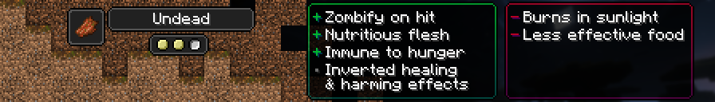

# Undead

!!! note

    The below details legacy content, accessed through a datapack in the world creation screen, or can be downloaded at [this GitHub Repository.](https://github.com/MerchantPug/legacy-toomanyorigins-datapack)

[Origin](../../origins.md).

A rare genetic mutation allows this race to keep their humanity despite suffering the effects of the Infection.

ID: `toomanyorigins:undead`

## Powers

Name | ID | Description (In-Game) | Description (Detailed)
-----|----|-----------------------|------------------------
*hidden* | `toomanyorigins:burn_timer` | *none* | When choosing this origin or respawning, you gain an ability cooldown that functions as a timer. When this timer is recharged it allows `toomanyorigins:no_helmet_burn` to activate as long as that ability's other conditions are met. This cooldown lasts for 1 minute and 30 seconds.
Deathly Bite | `toomanyorigins:deathly_bite` | Your melee attacks inflict a Zombifying effect on non undead mobs for a short time. Hitting any villager that has this effect zombifies them. | Your melee attacks inflict the [Zombifying](../../../effects/zombifying.md) effect on non Undead entities for 4.5 seconds.
Husk of a Former Self | `toomanyorigins:no_helmet_burn` | After 1 minute and 30 seconds of spawning in you burn in sunlight unless headwear is worn. | After `toomanyorigins:burn_timer` has ended its cooldown you start to burn in sunlight unless you wear something in your head slot that isn't part of the `toomanyorigins:ignore_head_slot` tag or use fire resistance.
Opposite Day | `toomanyorigins:opposite_day` | Instant Health and Instant Damage have the reverse effect. You are also immune to Regeneration, Hunger and Zombifying. | Sets your entity group to `player undead` swapping the effects of Instant Health and Instant Damage and making you take 60% of any extra damage from the Smite enchantment.
Cannibalism | `toomanyorigins:cannibalism` | Rotten Flesh is more nutritious for you. | Consuming Rotten Flesh gives you 4.5 more Hunger shanks and 10 more saturation.
Lacerated Liver | `toomanyorigins:lacerated_liver` | Foods that aren't rotten flesh are less saturating for you. | Foods that aren't rotten flesh are 50% as effective saturation-wise.
*hidden* | `toomanyorigins:damage_helmet_in_sun` | *none* | Whilst wearing a helmet and exposed to sunlight, your helmet loses 1 durability every 9 seconds.
*hidden* | `toomanyorigins:unholy` | *none* | You take `2.5 * level` extra damage from the Smite enchantment.
*hidden* | `toomanyorigins:zombify_hit` | *none* | If you hit a Villager with a melee attack while they are under the effect of the Zombifying status effect they will convert into a Zombie Villager.
*hidden* | `toomanyorigins:undead_immunities` | *none* | You are not effected by regeneration, hunger and zombifying effects.
*hidden* | `toomanyorigins:undead_callback` | *none* | Handles `toomanyorigins:burn_timer` upon respawning into the world.