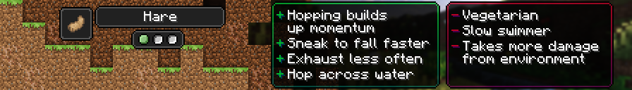

# Hiss-kin

!!! note

    This page details future content and is subject to change. If you would like to playtest these changes the files are marked as betas on CurseForge and Modrinth and as a pre-release on GitHub.

[Origin](../../origins.md).

A race of well-travelled intelligent rabbits that hop at such a speed they can skip across water.

ID: `toomanyorigins:hare`

## Powers

Name | ID | Description (In-Game) | Description (Detailed)
-----|----|-----------------------|------------------------
Hot Hops | `toomanyorigins:hot_hops` | Hopping while sprinting allows you leap forward, the amount you leap increases after each hop. | Your air speed increases by 0.00125 after leaping from the ground up to 7 consecutive times. This resets after being submerged in water, being grounded for 1 second, or when no longer sprinting.
Superfall | `toomanyorigins:superfall` | By sneaking while in the air you are able to fall at a faster rate, preventing fall damage. | Your falling velocity becomes 160% of the regular amount and you become immune to fall damage whilst sneaking. 
Frail | `toomanyorigins:frail` | You receive more damage from non-entity sources. | You receive one more damage from any damage source that does not have an attacker associated with it.
Vegetarian | `origins:vegetarian` | You can't digest any meat. | You cannot eat food items defined in the tag `origins:meat`, unless they are also defined in the `origins:ignore_diet` tag.
Drenchable Fur | `toomanyorigins:drenchable_fur` | As a creature susceptible to water, you are unable to move as quickly whilst in water. | You move 40% slower whilst in water.
Waterskipper | `toomanyorigins:waterskipper` | You are able to stand on the surface of water for a short amount of time whilst at maximum hopping speed. | Whilst at maximum hopping speed, and when not sneaking, you are able to stand on water surfaces for 0.5 seconds upon touching them. If you spend longer than this amount, you have to wait a second before attempting to waterskip again.
Small Appetite | `toomanyorigins:small_appetite` | You exhaust slower than others, thus you are able to eat less. | Everything you do exhausts you 60% less.
*hidden* | `toomanyorigins:extra_step_height` | *none* | You are able to step up an entire block when coming into contact with one, you are also allowed to jump immediately after performing this.
*hidden* | `toomanyorigins:prevent_movement_checks` | *none.* | Prevents movement checks performed by the server as they get in the way of Superfall.
*hidden* | `toomanyorigins:cancel_out_sprint_disable_on_hit` | *none.* | Fixes a vanilla bug where a player will stop sprinting serverside upon landing an attack on an entity.