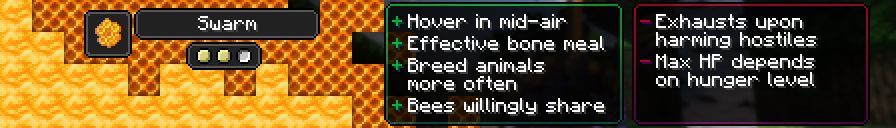

# Swarm

!!! note

    This page details future content and is subject to change. If you would like to playtest these changes the files are marked as betas on CurseForge and Modrinth and as a pre-release on GitHub.

[Origin](../../origins.md).

The Swarm race are hive independent insects, they are proficient farmers that avoid conflict.

ID: `toomanyorigins:swarm`

## Powers

Name | ID | Description (In-Game) | Description (Detailed)
-----|----|-----------------------|------------------------
Hover | `toomanyorigins:hover` | You are able to hover midair whenever you would be falling, exhausting and making you unable to use ranged weapons during the process. | While holding the jump key (Default: Space) whilst you are supposed to be falling, you are able to hover midair which exhausts you for a value of `0.05` if you are sprinting or `0.02` if you are not sprinting each tick. Using any item whilst hovering will increase this exhaustion amount by `0.03`.
Pollination | `toomanyorigins:pollination` | While you aren't sneaking, using bone meal additionally affects the 4 adjacent blocks. | Whilst not sneaking, any bone meal used on bone mealable blocks will also affect the adjacent 4 tiles.
Calming Aura | `toomanyorigins:calming_aura` | Animals bred by you do not have to wait to be bred again provided that they can't attack players or hostile mobs. | Animals that are not in the `toomanyorigins:ignore_calming_aura` tag can be bred again immediately.
Stinging Pains | `toomanyorigins:stinging_pains` | You exhaust whenever you harm hostile entities through direct means. | Harming `HostileEntity`s will exhaust you for `0.6` per individual damage dealt.
Unity | `toomanyorigins:unity` | You lose maximum hearts of health dependent on your hunger level. | You drop down to 7 maximum hearts upon reaching below 6 hunger shanks, you then drop down to 4 hearts upon reaching 3 hunger shanks.
Beekeeper | `toomanyorigins:beekeeper` | You will not anger bees upon taking from their hive. | Any interactions with beehives that would normally anger its bees do not anger them.
*hidden* | `toomanyorigins:arthropod` | *none* | You are classified as an arthropod, meaning you receive more damage from weapons enchanted with Bane of Arthropods.