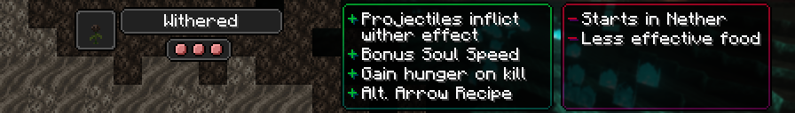

# Withered

!!! note

    This page details future content and is subject to change. If you would like to playtest these changes the files are marked as betas on CurseForge and Modrinth and as a pre-release on GitHub.

[Origin](../../origins.md).

A result of their ancestors harnessing the chaotic power of the Wither, they drain the life force out of those they kill.

ID: `toomanyorigins:withered`

## Powers

Name | ID | Description (In-Game) | Description (Detailed)
-----|----|-----------------------|------------------------
Affliction | `toomanyorigins:affliction` | Some projectiles will inflict Wither upon hitting a healthy target. | Hitting an entity with a projectile in the `toomanyorigins:withered_projectiles` entity type tag. This does not apply if used with an arrow with a potion effect, an arrow that is on fire, or a trident that has the Channeling enchantment in thunder spawning conditions. Wither effect particles will display from the projectile if these conditions are met. Additionally hitting an entity with a projectile in the `toomanyorigins:withered_projectiles` entity type tag will extinguish you, regardless of other conditions applied to the wither on hit.
Soul Siphon | `toomanyorigins:soul_siphon` | Upon killing an enemy, you drain their life force, filling your hunger. | Upon killing an entity, you will be fed based on the entity's max health attribute. You will be fed 4 food and 1.26 saturation if the entity has less than a maximum of 15 health, 6 food and 7.2 saturation if the entity has equal to or more than 15 maximum health but less than a maximum of 30 health, and 8 food and 12.8 saturation the entity has 30 maximum health or more. You are also fed 1 food and 2.4 saturation whenever an entity that you have attacked receives wither damage.
Nether Inhabitant | `origins:nether_spawn` | Your natural spawn will be in the Nether. | You will be teleported into the Nether when choosing this Origin. If you choose it by using an Orb of Origin, you will only respawn in the Nether if you die and do not have a valid spawn point in the overworld.
Hell-Raised | `toomanyorigins:hell_raised` | You gain access to an alternative recipe for arrows. | Arrows can additionally be crafted by replacing the feather with an item inside the `toomanyorigins:weavable_nether_plants` item tag.
Spirit Strider | `toomanyorigins:spirit_strider` | You have one extra level of soul speed at all times. | One level of the soul speed enchantment is added to you at all times. Having boots without soul speed does not use up the durability of them.
Deathly Digestion | `toomanyorigins:deathly_digestion` | Food items are less nourishing for you. | Food and saturation values from eating is decreased by 50% and everything you do whilst a non Nether dimension exhausts you 75% more.
*hidden* | `toomanyorigins:unholy` | *none* | You receive more damage from weapons enchanted with Smite.